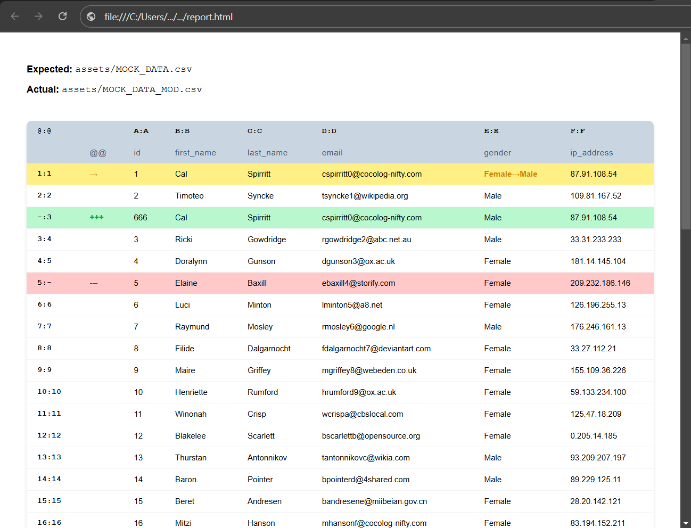

### exceldiff

This tool can help you validate and ensure that the values in an excel file or
in a CSV file are as expected, by making a comparison between one file as a
source of truth and another with the actual values. The comparison generates an
html report that can help you visualize the differences.



### How to use

Clone the repo and enter to the folder
```bash
git clone https://github.com/Darkensses/exceldiff.git
cd exceldiff
```

Install the dependencies
```bash
npm install
```

Run the tool
```bash
node index.js -e EXPECTED.xlsx -a ACTUAL.xlsx -r REPORT.html
```

If you want to test it first, you can execute the following command:
```bash
node index.js -e assets/MOCK_DATA.csv -a assets/MOCK_DATA_MOD.csv -r report.html
```

### CLI Usage
```
node index.js -h
Usage: index.js --original [path] --compare [path] --report [path]

Options:
      --version   Show version number                                  [boolean]
  -e, --expected  Path to the original file                  [string] [required]
  -a, --actual    Path to the file to compare                [string] [required]
  -r, --report    Path to the report file                    [string] [required]
      --help      Show help                                            [boolean]
```